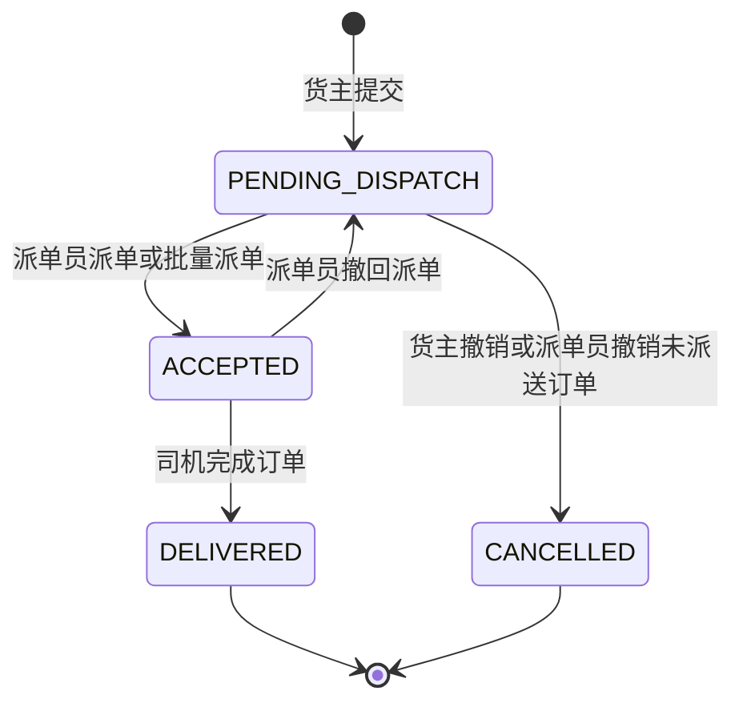

# 领域模型：订单状态机、三端权限矩阵、派单员审计

本文档固化 [requirements.md](../requirements.md) 中的业务规则，供前后端与代码生成保持一致。

---

## 1. 订单状态机

### 1.1 状态枚举

| 状态代码 | 展示名 | 说明 |
|----------|--------|------|
| `PENDING_DISPATCH` | 派单中 | 货主已提交，待派单员派单或撤销 |
| `ACCEPTED` | 已接单 | 已指派司机，司机可配送 |
| `DELIVERED` | 已送达 | 司机完成且至少上传一张送达照 |
| `CANCELLED` | 已撤销 | 终态，货主或派单员撤销（未派送时） |

**说明**：列表 Tab「全部」为查询条件，非独立状态。

### 1.2 合法迁移

| 自 | 事件 | 至 | 执行者 |
|----|------|-----|--------|
| — | 创建订单 | `PENDING_DISPATCH` | 货主 |
| `PENDING_DISPATCH` | 派单成功 | `ACCEPTED` | 派单员 |
| `PENDING_DISPATCH` | 撤销 | `CANCELLED` | 货主 |
| `PENDING_DISPATCH` | 撤销 | `CANCELLED` | 派单员（仅未派送） |
| `ACCEPTED` | 撤回派单 | `PENDING_DISPATCH` | 派单员 |
| `ACCEPTED` | 完成订单 | `DELIVERED` | 司机 |

**禁止**：`DELIVERED`、`CANCELLED` 不允许再变更业务状态（除非后续单独定义「异常/售后」扩展）。

---

## 2. 三端权限矩阵

约定：**读** = 列表/详情；**写** = 创建/更新/删除。**—** = 不允许。

**RBAC 说明**：派单员在服务端对「权限码」校验为 **最高业务角色**（`role_has_permission` 对 `dispatcher` 恒为真，详见 `app/core/rbac.py`）；下表从**业务能力**角度描述，与接口层 `require_permission` 一致。货主专属数据域（如仅货主地址本 API）仍仅限货主身份。

| 能力 | 货主 | 司机 | 派单员 |
|------|------|------|--------|
| 创建订单（→ 派单中） | ✓ | — | ✓（代下单，可选归属货主） |
| 查看自己的/被指派的订单 | ✓（仅自己） | ✓（仅指派给自己） | ✓（全部） |
| 撤销订单（终态已撤销） | ✓（仅派单中） | — | ✓（仅未派送） |
| 派单 / 批量派单 | — | — | ✓ |
| 撤回派单 | — | — | ✓（已接单且未完成） |
| 编辑订单内容（商品、地址、价格等） | — | — | ✓ |
| 内部备注（图文） | — | 读/写（仅指派单） | 读/写 |
| 导航、上传送达照、司机备注、完成订单 | — | ✓（仅指派单） | — |
| 商品价格 / 货主特殊价 | — | — | ✓ |
| 货主账本查看与编辑、补录 | — | — | ✓（按货主） |
| 货主账本查看与导出 | ✓（仅自己） | — | ✓ |
| 全局搜索订单 | — | — | ✓ |
| 数据看板 | — | — | ✓ |
| 消息中心 | ✓（本人） | ✓（本人） | ✓（本人） |

---

## 3. 派单员操作审计

### 3.1 需记录审计的操作（最低集）

| 操作类型 | 触发场景 | 必填字段 |
|----------|----------|----------|
| `ORDER_EDIT` | 派单员编辑订单任意字段 | 操作人、时间、订单 ID、变更字段 diff 或前后快照 |
| `DISPATCH_CANCEL` | 撤回派单 | 操作人、时间、订单 ID、**撤回原因**、撤回前订单快照 |
| `DISPATCH_ASSIGN` | 单订单派单 / 批量派单 | 操作人、时间、订单 ID、司机 ID、派单时间 |
| `PRICE_CHANGE` | 默认价或货主特殊价变更 | 操作人、时间、商品/货主范围、旧值、新值、是否已通知货主 |
| `LEDGER_EDIT` | 账本行修改或补录 | 操作人、时间、货主 ID、账本行 ID、变更内容 |

### 3.2 审计记录通用字段（建议 schema）

| 字段 | 类型 | 说明 |
|------|------|------|
| `id` | UUID | 主键 |
| `action` | string | 见上表操作类型 |
| `actor_id` | string | 派单员用户 ID |
| `actor_role` | string | 固定 `dispatcher` |
| `target_type` | string | 如 `order`、`ledger`、`product_price` |
| `target_id` | string | 业务主键 |
| `reason` | string? | 撤回派单等必填 |
| `payload` | JSON | 变更 diff、**订单快照**、扩展字段 |
| `created_at` | datetime | UTC 或统一时区 |

### 3.3 订单快照（撤回派单）

撤回派单时 `payload` 中应包含可恢复争议所需的 **订单完整快照**（至少：商品行、地址、联系人电话、金额、内部备注引用、当时派单司机 ID）。

---

## 4. 与实现相关的 ID 与关联

- **派单**：订单与司机 **多对一**（当前派单）；撤回后同一订单可再次派给其他司机。
- **送达照片**：从属于订单 + 司机上传批次；水印信息可冗余存于资源元数据或订单扩展表。
- **账本行**：与订单/商品行可关联；派单员补录行需标记来源（`order` | `manual`）。
